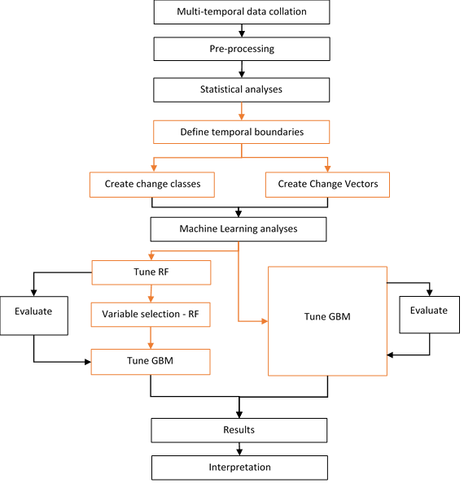
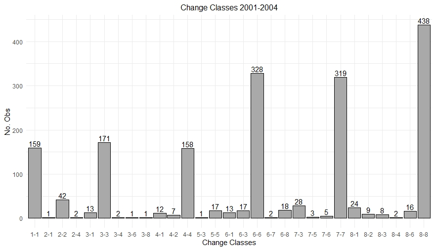

## Predictive Geodemographics ##


&nbsp;

Geodemographic classifications are temporally static, but geodemographics are area-based classifications, and areas are *dynamic*. 

&nbsp;

$$ Geodemographic Change = ∑Sociodemographic Processes$$


- gentrification and displacement
- urban decay
- suburbanisation and counter-urbanisation 


Use multitemporal open data as proxies for attributes to sociodemographic processes (gentrification and displacement) to predict geodemographic change pairs. 


&nbsp;





&nbsp;





#### Comparison of Methods
- Gradient Boosting Machine 
- Multitemporal feature selecred variables - 51% accurate
- Change Vector Analysis (CVA) - 48% accurate **BUT** greater speficity of dynamic geodemographic change


```{r setup, include=FALSE}
knitr::opts_chunk$set(echo = TRUE)
```


&nbsp;


### Visualisation


Introduced to new software - QGIS - to develop data visualisation skills, specifically for spatiotemporal data (with TimeManager plugin).  


&nbsp;

Mapping <span style="color:gold"> **_golden rules_** </span>

1. Black Background! 


&nbsp;

2. Fancy Font?

3. Existing colour packages, **BUT** experiment with blending modes

4. Gifs - great for the lazy reader!  

5. QGIS TimeManager - perfect for quick, easy, effective GIFs, but also for the initial exploration and the visualisation of spatiotemporal data

- Can I see any patterns?
- Are they what I expected?

6. Although I am working with spatiotemoral data, I may not always be able to display my outputs in the most appropriate manner (GIFs?!), but static maps can still be effective when using appropriate colours and blending 


&nbsp;


### Reproducibility


How to better improve the reproducibility of your work via version control (Git)

&nbsp;


My current folder organisation:

1. Logical? X
2. Easy to navigate? X
3. A million seperate folders and document revisions? ✓ 


Version control **is** my **friend**


1. Need to rerun a specific analysis? ✓ 
2. Reproducible papers? ✓
3. R? cmd? ✓
4. Online collaborators? ✓ 


### Science Communication 


How to improve our communication (writing and presenting) through a series of small exercises to improve our writing process. 

&nbsp;

The purpose of scientific writing is to fill a gap in knowledge, and to tell and sell that knowledge with and the scientific community. 

&nbsp;

_Brown's 8 Questions_

Focus Focus Focus! 

- Identify appropriate audience 
- Defining the purpose 
- Creating a story 


I had the most productive writing session in that hour and half than I have in the past two months! 

